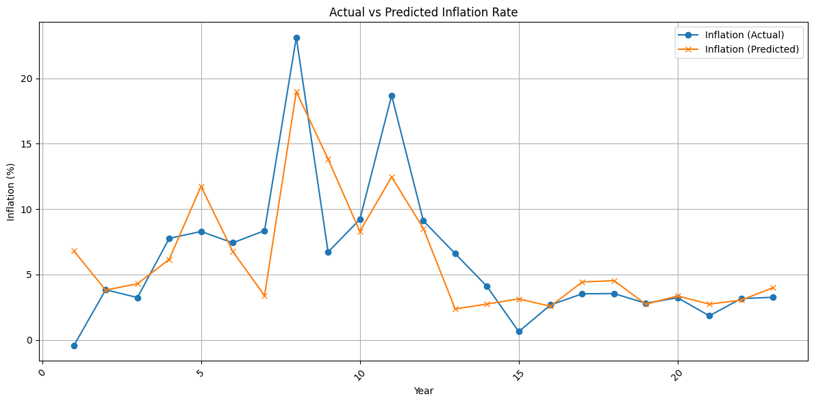

<h1 style="font-weight:bold; text-align:left; font-size:36px; color:#0066cc;">
  Research Assistant
</h1>

<p style="text-align:left; font-size: 25px; color:#555;">
  <strong>Nguyen Duc Huy</strong> | 
  <span style="color:#999; font-size:18px;">18-07-2005</span>
</p>

```{r setup, include=FALSE}
knitr::opts_chunk$set(echo = TRUE)
```

<p style="text-align:left; font-style:italic; font-size:16px;">
 Motivated data analyst eager to contribute analytical skills and economic knowledge to impactful research projects.
</p>


{width=300px}


### <span style="color:#CD950C;"><b>Contact</b></span>

📞<span style="color:royalblue;"><b>Phone number</b></span>: 012****248  
📧<span style="color:royalblue;"><b>Email</b></span>: huyducnguyen****@gmail.com  
🔗<span style="color:royalblue;"><b>LinkedIn</b></span>: Đức Huy


### <span style="color:#CD950C;"><b>About me</b></span>  
My name is Nguyen Duc Huy, and I am a motivated and detail-oriented candidate with a strong background in data analysis and research. I have hands-on experience working with R, managing and analyzing large datasets, and creating reproducible reports using R Markdown. My academic training and independent projects have equipped me with solid quantitative and analytical skills, making me well-prepared to contribute to data-driven research work. I am enthusiastic about supporting impactful studies and learning from experienced researchers in a collaborative environment.  


### <span style="color:#CD950C;"><b>Academic background</b></span>    
<span style="color:royalblue;"><b> Graduate from</b></span>:  Eastern International University  
<span style="color:royalblue;"><b> Major</b></span>: Economics and Data science  
<span style="color:royalblue;"><b> Concentration</b></span>: Data analysis\
<span style="color:royalblue;"><b> Other certifications</b></span>: IELTS  


### <span style="color:#CD950C;"><b>Skill</b></span> 
💻 R, Python, R Markdown
📊 Regression analysis, data   visualization  
🌍 English (IELTS), Vietnamese (Native)


### <span style="color:#CD950C;"><b>Experience</b></span>  
<span style="color:royalblue;"><b> Research Project:</b></span> **The Impact of Money Growth on Inflation**  
University Coursework | Jun 2025 – Sep 2025  
- Investigated the long-run relationship between money supply growth and inflation using macroeconomic data  
- Applied regression analysis techniques in **R** and **Python** to evaluate the Quantity Theory of Money  
- Interpreted findings within the context of classical and modern economic models

<span style="color:royalblue;"><b> Campus Research:</b></span> **Reducing Plastic Waste at EIU**  
EIU Sustainability Initiative | Oct 2024 – Jul 2025  
- Conducted a waste audit and surveyed student behavior to identify major sources of plastic consumption  
- Proposed actionable strategies to reduce single-use plastics across campus  
- Presented findings to university stakeholders as part of an environmental awareness campaign

<span style="color:royalblue;"><b> Field Study:</b></span> **Bridging the Expectation-Reality Gap for Vietnamese Professionals in Japan**  
Independent Research | Jul 2025 – Aug 2026  
- Explored the cultural and workplace challenges faced by Vietnamese professionals under the "Engineer/Specialist in Humanities/International Services" visa  
- Designed and distributed bilingual surveys; conducted in-depth interviews with migrant workers  
- Analyzed qualitative data to highlight mismatches in job expectations vs. actual conditions, contributing to ongoing discourse on labor migration  

*For more details about each research project, please access corresponding tabs:*  


### <span style="color:#CD950C;"><b>Research</b></span> {.tabset}
#### **Research Project**
<p align="center">
  
</p>
In this project, I explored the long-run relationship between monetary expansion and inflation, drawing from classical and monetarist theories such as the Quantity Theory of Money. I collected time-series data on money supply (M2), CPI, and GDP growth in Vietnam. Using R and Python, I applied OLS regression models and conducted stationarity tests to ensure robustness. The findings barely confirmed a positive correlation between money growth and inflation in Vietnam. This study helped reinforce my understanding of macroeconomic dynamics and the challenges of monetary policy design.  

#### **Campus Research**
<p align="center">
  
</p>

This campus-based project aimed to develop practical solutions to reduce plastic waste across Eastern International University. I led a waste audit across key locations, conducted a survey, and identified the main sources of plastic use — primarily bottled water and food packaging. Based on the data, we proposed policy recommendations such as refill stations, awareness campaigns, and incentives for reusable containers. Presenting these findings to EIU sustainability coordinators allowed me to see how data can drive real behavioral change.

#### **Field Study**
<p align="center">
  
</p>

This independent qualitative study examined the mismatch between career expectations and workplace realities for Vietnamese migrants working in Japan under the "Engineer/Specialist in Humanities/International Services" visa. I designed a bilingual questionnaire and conducted in-depth interviews with Vietnamese professionals across Tokyo and Osaka. Common themes included cultural misunderstandings, overwork, and limited career mobility. The study emphasized the need for better pre-departure counseling and support mechanisms. It also sharpened my skills in qualitative data analysis, especially thematic coding and cross-case comparison.  

###


